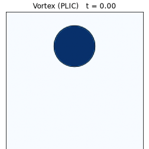
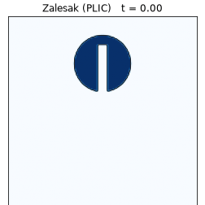
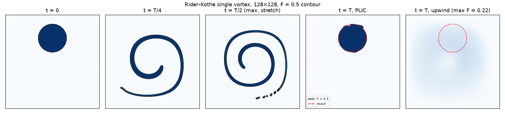
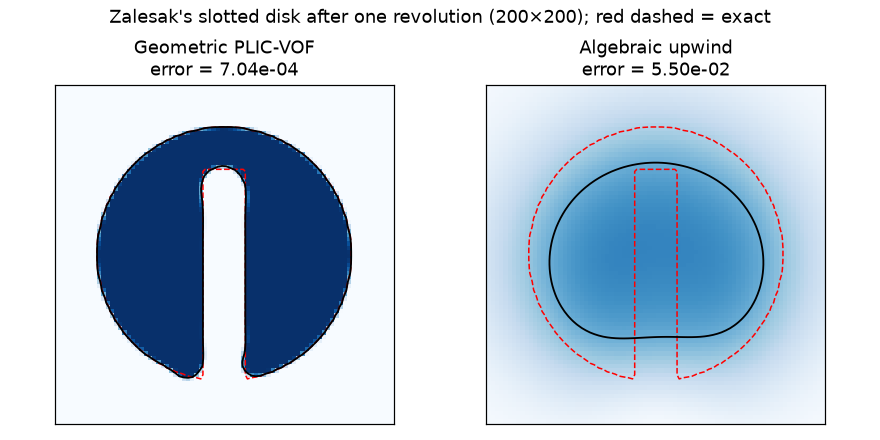

# VOF Interface Advection: Geometric PLIC

[](https://github.com/cfdgasman/vof-interface-advection/actions/workflows/ci.yml)

A geometric **Volume-of-Fluid** solver with **PLIC** interface reconstruction, tested on the two classic interface-advection benchmarks. In both tests the exact answer is simply the initial shape, so any change to the interface is numerical error. The code compares **geometric PLIC** with **algebraic upwind** advection.

<p align="center">

&nbsp;&nbsp;

</p>

## Benchmarks

| Test | Flow | What it tests |
|---|---|---|
| **Rider–Kothe single vortex** | ψ = sin²(πx) sin²(πy) cos(πt/T)/π, T = 8 | Stretches a circle into a thin spiral, then **reverses exactly** back to the circle |
| **Zalesak's slotted disk** | Rigid-body rotation, one revolution | Must preserve **sharp corners** and a thin slot |

## Method

| | |
|---|---|
| Reconstruction | Youngs' normal (3×3 gradient of F); analytic line-constant ↔ volume relations (Scardovelli & Zaleski 2000) |
| Advection | Directionally split **geometric fluxes**, the exact area of the PLIC polygon crossing each face, with the **Weymouth & Yue (2010)** dilation correction |
| Time stepping | Split order alternates each step (x-y, then y-x); midpoint velocity; CFL = 0.5 **enforced against the midpoint velocity** |
| Velocity | Face velocities from a corner stream function, so the discrete divergence is exactly zero |
| Comparison | Algebraic first-order upwind with the same splitting |

## Results

### Single vortex (T = 8)

<p align="center"></p>

| Grid | PLIC shape error | Order | Upwind error | Mass error | min F | max F − 1 |
|---|---|---|---|---|---|---|
| 32² | 4.93e-02 | – | 1.22e-01 | 1e-15 | 0 | 0 |
| 64² | 1.06e-02 | 2.22 | 1.21e-01 | 4e-15 | 0 | 0 |
| 128² | 2.02e-03 | 2.39 | 1.16e-01 | 8e-15 | 0 | 0 |
| 256² | 6.49e-04 | 1.64 | 1.08e-01 | 1e-14 | 0 | 0 |

Shape error E = Σ|F − F<sub>exact</sub>| h².

- **Mass is conserved to machine precision**, and F stays in **[0, 1] exactly**, with no clipping or redistribution needed.
- PLIC converges at about **second order**. Upwind hardly converges at all: by t = T its field has smeared so much that max F = 0.22, so the F = 0.5 contour has disappeared.
- At t = T/2 the filament tail breaks into droplets once it gets thinner than a cell. This is the expected resolution limit of any VOF method.

### Zalesak's slotted disk (200², one revolution)

<p align="center"></p>

PLIC error **7.0e-04** vs upwind **5.5e-02**, about 80× smaller. The slot and corners survive with only slight rounding.

### A bug worth mentioning

In the first version, the time step came from the velocity at the *start* of the step. The single-vortex velocity scales with cos(πt/T), so near t = T/2 it is almost zero, which allowed a huge Δt. The step was then taken with the non-zero *midpoint* velocity, so CFL was violated and F overshot [0, 1] by up to 7 %. The fix re-checks CFL against the midpoint velocity. It is now covered by a test that checks mass conservation and boundedness.

## Usage

```bash
pip install -r requirements.txt
python run.py      # tables, figures and GIFs in docs/ (~2.5 min, mostly the 256² run)
pytest
```

## References

W. J. Rider, D. B. Kothe, *Reconstructing volume tracking*, J. Comput. Phys. 141 (1998) 112–152.
S. T. Zalesak, *Fully multidimensional flux-corrected transport algorithms for fluids*, J. Comput. Phys. 31 (1979) 335–362.
G. D. Weymouth, D. K.-P. Yue, *Conservative Volume-of-Fluid method for free-surface simulations on Cartesian grids*, J. Comput. Phys. 229 (2010) 2853–2865.
R. Scardovelli, S. Zaleski, *Analytical relations connecting linear interfaces and volume fractions in rectangular grids*, J. Comput. Phys. 164 (2000) 228–237.

## License

MIT
